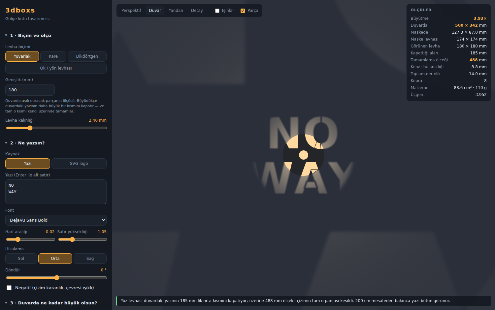

# 3dboxs — Gölge Kutu Tasarımcısı

Duvar LED'inin önüne geçen bir maske tasarlar. Işık maskedeki kesiklerden geçip
**duvara yazıyı ya da logoyu büyütülmüş olarak çizer**. Parçanın kendisi ortada
durur ve kendi üzerindeki kesiklerle yazıyı tamamlar.

Yazıyı ya da SVG logoyu ver, duvarda kaç santim olsun söyle — sistem maskeyi
hesaplar, 3B gösterir, **STL** olarak verir.



---

## Nasıl çalışıyor?

### Fiziksel kurulum — iki katman

```
   DUVAR |<--------------- H ---------------->| LED
         |                                     |
         |        MASKE        YÜZ             |
         |          |           |              |
         |<-- H−G ->|           |              |
         |<------- zf --------->|              |
```

- **H** — LED çipinin duvara olan uzaklığı
- **G** — LED çipi ile maske arasındaki boşluk
- **MASKE** — arkadaki küçük levha. Çizimi `1/M` ölçeğinde taşır; duvardaki
  keskin yazıyı **bu üretir**.
- **YÜZ** — görünen levha (yuvarlak / kare / dikdörtgen / ok). Çizimi
  **görünür ölçekte** taşır ve duvardaki yazının kendi gövdesinin kapattığı orta
  kısmını **tamamlar**.

Lambanın gövdesi her iki levhanın ortasındaki delikten geçer; boyun ikisini
birbirine ve lambaya bağlar. Tek parça basılır.

### Büyütme

LED'i nokta kaynak kabul edersek, maske üzerindeki `r` yarıçapındaki bir nokta
duvara `R` yarıçapında düşer:

```
R / r = H / (H − t)     ,  t = maskenin duvara uzaklığı = H − G
      = H / G
```

Yani **büyütme oranı `M = H / G`**. Duvarda 50 cm istiyorsan ve M = 4 ise,
maskeye 12,5 cm çizilir.

### Gölgeyi tamamlama — neden iki katman şart?

Levha, duvardaki yazının ortasını kapatır. Karşıdan bakan biri eksik bir kelime
görür. Levhanın üzerindeki kesikler o eksiği tamamlamalı — **yazının küçük bir
kopyasını tekrar etmemeli.**

Göz duvardan `D`, levha `zp` uzakta olsun. Levhadaki `r` yarıçaplı bir kesik,
gözün perspektifinde duvarın şu yarıçapına denk düşer:

```
R_görünen = r · D / (D − zp)
```

Aynı kesiğin ışıkla düşürdüğü iz ise `R_yansıyan = r · M`. İkisinin çakışması için:

```
D / (D − zp) = M = H / G   ve   zp = H − G     ⟹     D = H
```

Yani ancak **göz tam LED'in yerindeyken** çakışır. Başka her mesafede kesik ile
kendi yansıması ayrı yerlere düşer. Bu yüzden tek levhayla hem yansıtma hem
tamamlama yapılamaz; iki ayrı ölçek gerekir:

| Katman | Çizim ölçeği | İşi |
|---|---|---|
| Maske | `hedef / M` (örn. 127 mm) | Duvardaki keskin yazıyı üretir |
| Yüz | `hedef · (D − zf) / D` (örn. 488 mm) | Kapanan orta kısmı tamamlar |

Yüz levhasına 488 mm ölçekli çizim uygulanır ama levha 180 mm olduğu için
yalnızca **ortadaki parça** kesilir — tam da duvarda eksik kalan parça.

Kesikler karanlık kalmaz: yüz levhası ile maske arasındaki boşluk LED tarafından
aydınlatılır, önden bakınca o kesiklerden aydınlık boşluk görünür ve parlarlar.

> Tamamlama geometrik olarak **tek bir bakış mesafesinde** tam oturur. Panelde
> girdiğin `Bakış mesafesi` budur; "Duvar" görünümü kamerayı tam oraya koyar,
> yani önizlemede gördüğün şey o mesafeden göreceğin şeydir. Uzaklaştıkça
> ölçek duvardakine yakınsar, hizalama daha da toleranslı olur.

### Kenar keskinliği

LED gerçekte nokta değil. Işık veren yüzeyin çapı `s` ise duvardaki kenar
bulanıklığı yaklaşık `s × (M − 1)` olur. Keskin yazı istiyorsan küçük ışık
yüzeyi (COB/noktasal LED) kullan.

### Parlaklık düşüşü

Merkez en parlak, kenarlar hızla söner: `E(R)/E(0) = (H / √(H²+R²))³`
(ters kare yasası × kosinüs eğim düzeltmesi). Bu gerçek ve kaçınılmaz.

> Önizlemedeki **pozlama eğrisi** yalnızca ekranda gördüğünü etkiler
> (fotoğraf makinesinin pozu gibi). Ölçü panelindeki değerler ham fizikten gelir.

---

## Kullanım

```bash
npm install
npm run dev      # http://localhost:5173
npm test         # geometri ve optik testleri
npm run build    # dist/ klasörüne üretim derlemesi
```

### Sıra

1. **Biçim ve ölçü** — yuvarlak / kare / dikdörtgen / ok ve levhanın kaç mm olacağı.
2. **Ne yazsın** — yazıyı gir ya da SVG logo yükle.
3. **Duvarda ne kadar büyük olsun** — hedef ölçüyü mm cinsinden ver.
4. **Lamba ve optik** — `H`, `G`, gövde çapı ve ışık yüzeyi çapını gir.
   **Bu adımı kendi lambandan ölçmen gerekiyor** (aşağıya bak).
5. **Gölgeyi tamamlama** — bakış mesafesini gir.
6. **Çıktı** — STL indir.

### Lambanı ölçmek

Hazır ayarlar sadece başlangıç noktasıdır, **kesin ürün verisi değildir**.
`H` yanlışsa duvardaki boyut da yanlış çıkar. Lambayı duvara tak ve ölç:

| Ölçü | Nasıl ölçülür |
|---|---|
| **H** | Duvar yüzeyinden LED çipinin ön yüzüne kadar (cetveli duvara dayayıp oku) |
| **Gövde çapı** | Maskenin geçeceği silindirik gövdenin çapı — boyun buna oturur |
| **Işık yüzeyi çapı** | Işık veren parlak alanın çapı (difüzör varsa onun çapı) |

`G`'yi sen seçersin: büyütmeyi belirleyen ayardır. Parçanın boyun boyu buna göre
otomatik hesaplanır.

---

## Şablon köprüleri

"O", "A", "8", "Ö" gibi harflerin göbeği levhadan tamamen kopar ve baskıda yere
düşer. Sistem bu adaları bulup ince köprülerle gövdeye bağlar.

Köprüler duvara da yansır: harfin içinden geçen ince karanlık çizgi olarak
görünürler. Bu klasik şablon görüntüsüdür ve kaçınılmazdır. Kalınlığını ve ada
başına köprü sayısını 6. bölümden ayarlayabilirsin — ince köprü daha az belli
olur ama baskıda daha kırılgandır.

`Köprü` sayacı 0 ve `kopuk parça` uyarısı yoksa, model tek parçadır.

---

## Baskı

STL milimetre birimindedir ve düz yatacak şekilde konumlandırılmıştır.

| Ayar | Öneri | Neden |
|---|---|---|
| Malzeme | **PETG** ya da **ASA** | Lambaya yakın durur, PLA zamanla sarkabilir |
| Renk | **Opak siyah** | Işık sızıntısını keser, kontrastı artırır |
| Katman | 0,2 mm | |
| Duvar sayısı | 3+ | İnce köprüler bununla sağlamlaşır |
| Dolgu | %20+ | |
| Destek | **Gerekmez** | Parça düz yatar |

Levha kalınlığını 2 mm'nin altına indirme; ışık ince duvardan sızar ve kontrast
düşer.

> **Isı uyarısı:** Bu parça bir aydınlatma armatürünün üzerine oturuyor.
> Yalnızca soğuk çalışan LED'lerle kullan. Lambanın havalandırmasını kapatma;
> halojen, akkor ya da elle tutulamayacak kadar ısınan hiçbir armatürde kullanma.

---

## Çıktılar

| Buton | Ne verir |
|---|---|
| **STL** | Baskı için katı model (levha + boyun + bordür) |
| **SVG** | Lazer kesim / CNC için iki dosya: maske düzlemi ve yüz levhası, gerçek mm ölçüsünde |
| **PNG** | O anki 3B görünümün ekran görüntüsü |
| **JSON** | Bütün ayarlar — geri yükleyip kaldığın yerden devam edebilirsin |

---

## SVG logo yüklerken

- Yalnızca **dolgulu** alanlar kesilir. Sadece çizgiden (stroke) oluşan
  logoları vektör programında "outline"a / dolguya çevir.
- Delikler iki farklı gelenekle çizilir ve ikisi de destekleniyor:
  1. Tek yolun alt yolları (fill-rule ile) — doğrudan çalışır.
  2. Gövdenin üstüne beyaz şekil çizmek — **"Açık renkleri delik say"** kutusu
     bunu halleder. Logon boş çıkarsa bu kutuyu kapat.

---

## Negatif mod

Normalde çizim ışıklı, çevresi karanlıktır. **Negatif** modda tersi olur: çizim
karanlık siluet hâlinde kalır, çevresi aydınlanır. Bu modda harfleri havada
tutmak için levha kenarında bir çerçeve bırakılır ve harfler oraya köprülenir.

---

## Mimari

```
src/
  core/
    optics.js      M = H/G, yarı gölge, doğrulama    ← bütün fizik burada
    polygons.js    poligon yardımcıları, biçimler
    text.js        yazı → poligon (glif glif dizgi)
    svgimport.js   SVG → poligon (boyacı modeli delikler)
    bridges.js     kopuk göbekleri bulup köprüleme
    plate.js       levha kurgusu (kesme, negatif, delik)
    model.js       iki katmanı kurup birleştirir
    extrude.js     2B → 3B katı (earcut + yan duvarlar)
    seal.js        açık kenarları dikme (su geçirmezlik)
    housing.js     boyun ve kenar bordürü
  three/
    projection.js  duvar dokusu (analitik yansıtma)
    viewer.js      3B sahne
  ui/              panel ve form parçacıkları
  export/          STL / SVG / indirme
tests/             geometri, optik, su geçirmezlik ve geniş tarama testleri
```

### Su geçirmezlik neden ayrı bir adım?

earcut, delikleri dış hatta "köprü" atarak eler. Yazıdaki harfler ortak taban
çizgisinde durduğu için farklı harflerin kenarları birebir eşdoğrusal olabiliyor;
köprü de o doğruya denk geldiğinde kapak üçgenlemesi ile yan duvarlar
birbirine dikilmiyor ve STL'de küçük delikler kalıyor.

`seal.js` bunu kökten çözüyor: dengesiz kalan yönlü kenarları toplayıp kapalı
çevrimler hâlinde üçgenliyor. `tests/stress.test.js` 22 farklı yazı, 4 levha
biçimi, 3 font ve 27 optik kombinasyonunda çıktının açık kenar içermediğini ve
tek parça olduğunu doğruluyor.

---

## Lisans

Proje kodu bu deponun lisansına tabidir.

Paketlenen fontlar kendi lisanslarıyla gelir:

- **DejaVu** (`public/fonts/DejaVu*`) — DejaVu Fonts License (Bitstream Vera türevi, serbest)
- **Liberation** (`public/fonts/Liberation*`) — SIL Open Font License 1.1
